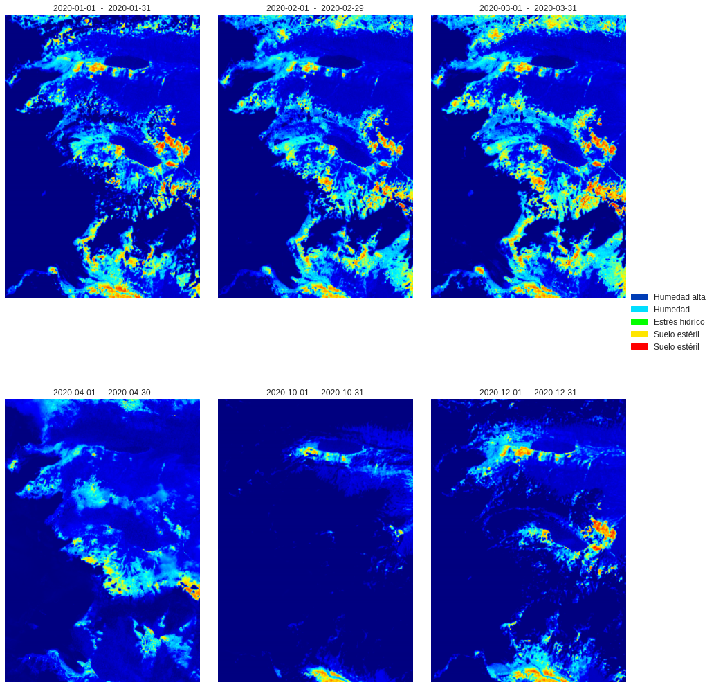

# Data Engineer

## Work Experience
### Data Engineer @ Adastra _(Apr 2023 - Present)_
__Client 1: Bank__
*	Developed and maintained ETL processes in Azure Data Factory, facilitating seamless data integration into Power BI reports and models for banking clients.
*	Ensured 100% data accuracy in reports by enhancing and maintaining employee hierarchy models, aligning them with business rules.
*	Attend client needs by responding to tickets, delivering new analytical solutions like new reports and stored procedures, and improving existing ones.

__Client 2: Manufacturer and distributor company__
* Mapping data sources and gathering requirements for implementing a Medallion Architecture on Azure Fabric.
* Developing pipelines for extracting and loading data from data sources into a centralized data lake.
* Creating notebooks for applying QA to the data and performing data transformations to enhance data integrity and usability.

### Senior Data Engineer @ ProCibernetica _(Oct 2023 - Mar 2024)_
* Enhanced and optimized data pipeline development for a data warehouse integration, effectively incorporating over 100 diverse data sources.
* Developed test cases for each data pipeline, ensuring robust data preparation for subsequent machine learning model implementation.
* Led a data modeling team, crafting targeted data marts that directly address and resolve specific business inquiries.
* Successfully migrated codebase from Oracle SQL to PySpark and MySQL, improving the efficiency and accuracy of ELT processes and data modeling.

### Business Intelligence Developer @ Alegra _(Sep 2022 - Apr 2023)_
* Led the company’s data stack implementation and maintenance using AWS.
* Developed ETL processes using AWS Redshift, S3, EMR, DMS, and Lambda to streamline data processing.
*	Monitored data integrity processes, enhancing data availability and reliability for batch operations.
*	Created and maintained interactive dashboards on BI platforms for strategic decision-making.
*	Developed and maintained the data analytics infrastructure using Python, Spark, and best practices.

### Data Scientist @ National University of Colombia _(Mar 2020 - Nov 2022)_
* Extracted data using the Twitter API to provide early alerts for meteorological events using NLP techniques.
* Conducted exploratory analysis of meteorological data from Manizales city, identifying patterns and trends to inform risk mitigation strategies.
* Developed and implemented data pipelines with ETL processes and analytics algorithms using SQL and Python, enabling the treatment of hydrometeorological datasets and imputation of missing data.

### Intern Data Engineer @ Bancolombia _(Jul 2021 - Jan 2022)_
* Developed and implemented ETL processes, constructing data pipelines using Python, Spark, and SQL.
* Created monthly reports to extract KPI metrics for one of the bank’s products, integrating multiple data sources.
* Enhanced client segmentation to optimize marketing strategies and boost customer engagement.
* Designed interactive dashboards with Business Intelligence tools, providing stakeholders with actionable insights for informed decision-making.

## Certifications 

   
  

## Personal Projects

### Satellite Images Analysis

   

This satellite image analysis project was developed in collaboration with a professor from Chile to address the need to access satellite imagery data across different years. Utilizing images from the Sentinel-2 satellite and leveraging the SentinelHub API, the project focused on extracting and transforming images for detailed terrain type analysis on a global scale. This work formed the basis of my undergraduate thesis, which was honored as the best graduation project of 2023 in my field. Additionally, it was showcased at research meetings in Bogotá, Colombia, and Chile during 2022.

[Notebook](https://github.com/Jacoceb/asi-thesis/blob/main/An%C3%A1lisis_de_imagenes_satelitales.ipynb)

__Tech stack:__ _Python and Javascript_

## Education
#### Bachelor's degree in Information Systems Administration
National University of Colombia | _February 2017 - July 2022_
